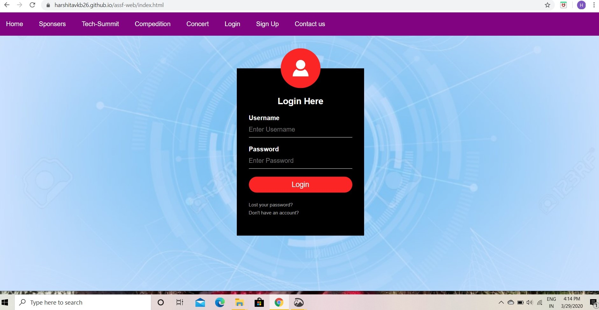
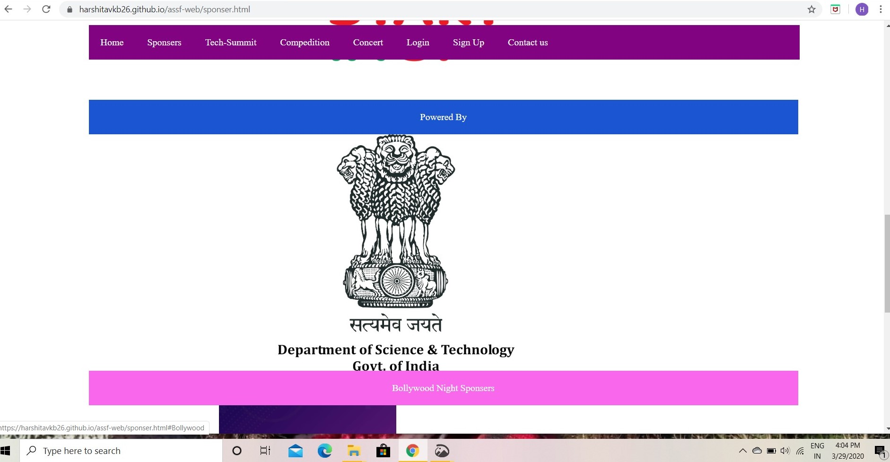
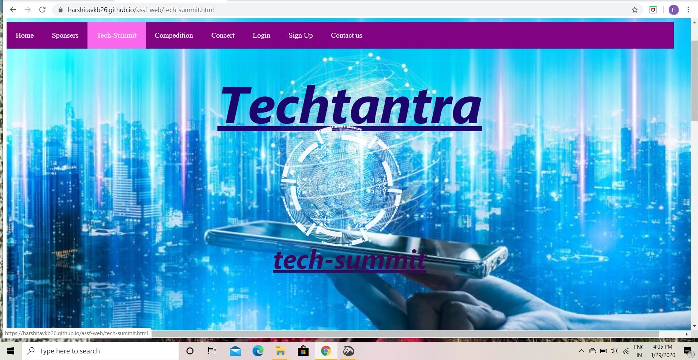
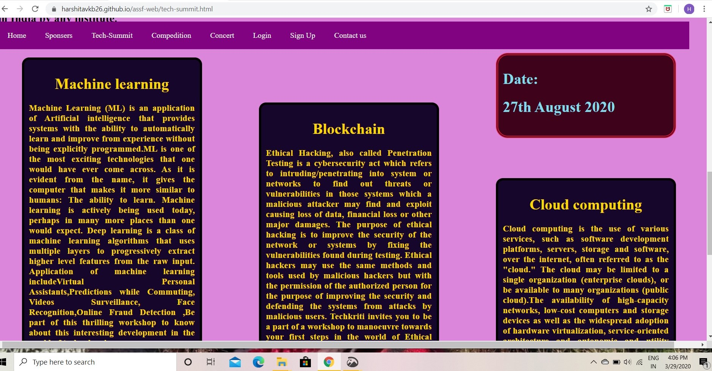
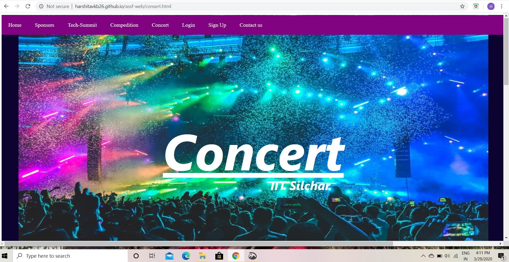
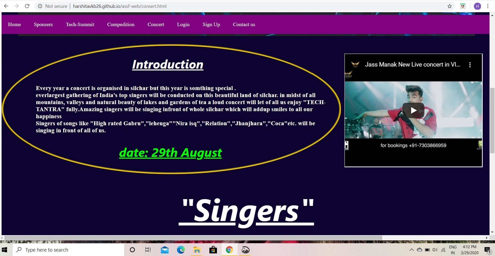
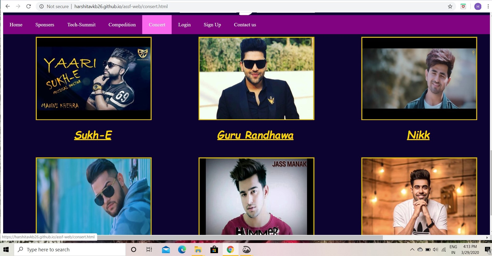
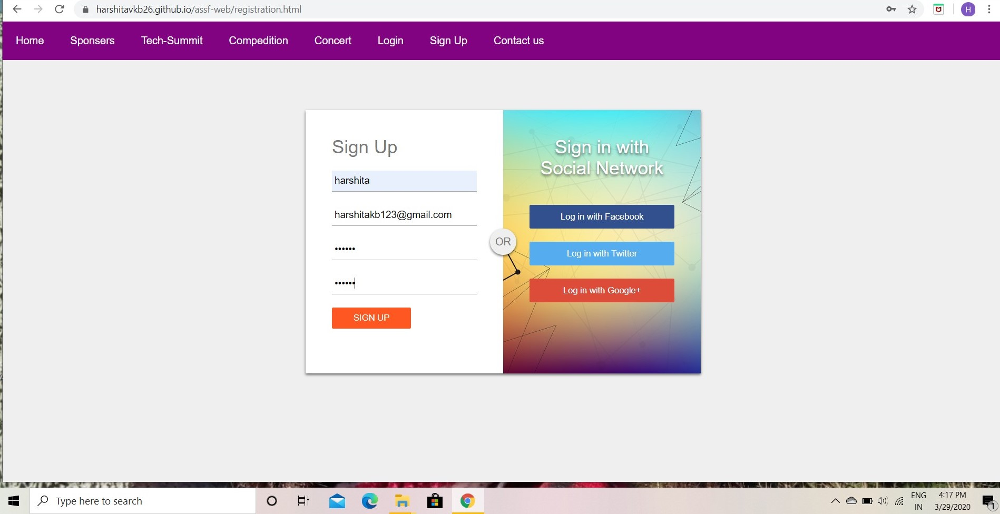
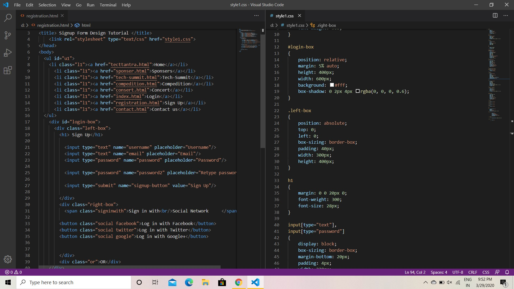

# assf-web
## introduction
    This is my very first project to creat a website. It is basically website of a tech-fest of IIT Silchar
    named "TACHTANTRA". this project is created by Harshita Verma and Shweta Singh. Front-end is done by 
    Harshita verma and back-end is done by Shweta singh.
# About -
## login page
When we open the website we first reach on "login" page.

 This page contains Username and password .
 Using this page one can sign in into his/her account by entering username and password.
### Features 
*  when curser mover to username and password it appears "Please fill out yhis field".
*  when curer is over login button its color changes from red to yellow.
*  if we forget our password we can creat a new password using "lost your password" link.
*  to creat a new account we can click on "don't have account " link ,which will direct us 
   to Sign up page.
## Home page
### discription of home page
Home page contains title bar . it's position is relative not fixed in home page .
It contains the information about all the events and about compedition and the notification
about live concert and the numbers of important authority holders.

### Features
* It contains logo of IIT Silchar ,A beautiful backgound image on which date of the events
are written.
* it contains introduction about "TECHTANTRA".

* And using iframe a video of live concert of Guru Randhawa is also featurised.
## Sponser page

### Features
* here title bar is fixed which enables user to directly jump on other web pages,
and its color also changes when curser moves on it.
* The sub headings of sponser page like co-presented by, title sponser changes its 
color from blue to pink.
* this page contains logo of all the main sponser.
## Tech-Summit Page

### Features
* It contains a vibrant background image and logo of IIT Silchar.
* it contains title bar which is fixed so that we can move to any disired page.

* It contains a special div specifing the date of the event.
* Three blogs of "machine Learning","Block Chain" and "Cloud-Computing" specifies their
importance.And these blogs are arranged in starecase manner using CSS.
## Compedition Page

### Features
* The Humurous background image shows compeditive scenario in today's world.
* It promotes apisthemology of compedition among participants.
* the image contains a compedition tag too.

* In compedition page each image discribes about a specific compedition.
* The images viewed work as a link.
* On clicking Either on image or on image tag it will take you to same web page.
* the web page which will be opened provides description about the compedition event
on which you clicked.

* The web page opened specifies name of the compedition in an eye-chatchy manner.
* blog below it gives information about compedition, gidelines to be followed and worth 
of the prize given to winning team.
* This web page also contains a specilised anchor tag " GO BACK" which will lead you to 
main compedition web page.
* In this way you will be well occupied with all the information of the respective compedition
you want to participate in.
## Concert

* The sound of loud music sprays happiness all around therefore a concert adds up smiles and 
happiness.
* A vibrant ,glorious , glossy and crazy concert image as a background image increases the 
intencity of enjoying life.
* The image we see let us to be carefree from all the daily life tentions.

### Features
* An oval introductory blog gives a brief discription about the concert.
* An iframe is used to create enthusiasm among participants regarding the concert
of juss manak.
* in this page CSS is used very beautifully to highlight the components of the page,
with the help of CSS these simple elements gives a royal look to the page.
* here date is also highlighted in an eye-chatchy manner.

* Images and the names of all the super six singers has been provided in the page.
## Sign up

* Using this page one can creat his new account to register himself to be a part of the
"TACH_TANTRA".
* by entering username and email and creating a new password he can register himself.
* The present social networking youth can also sign up by using their facebook,twitter or 
google accounts.
* This information will be saved using "MYSQL" database with the help of which you can 
login to the side  again easily.
* You can go to this Sign up page either using Sign up tag or using the "don't have an account "
tag in login page.
* In this page some special CSS is also used to make it attractive.
* whoes code is here

## Contact Us Page
### Features
* Contact number of all the technical experts,Hospitality team heads and Co-ordinators
are displayed in this page for any Query,complain or suggetions.
* the background image shows the connectiveness and flexibality of techtantra team.
