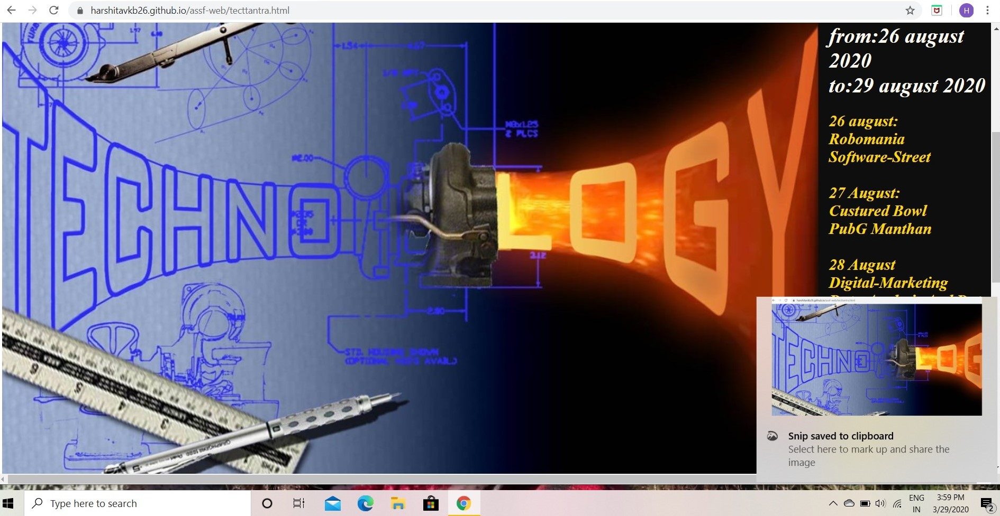

# assf-web
## introduction
    This is my very first project to creat a website. It is basically website of a tech-fest of IIT Silchar
    named "TACHTANTRA". this project is created by Harshita Verma and Shweta Singh. Front-end is done by 
    Harshita verma and back-end is done by Shweta singh.
# About -
## login page
When we open the website we first reach on "login" page.

 This page contains Username and password .
 Using this page one can sign in into his/her account by entering username and password.
### Features 
*  when curser mover to username and password it appears "Please fill out yhis field".
*  when curer is over login button its color changes from red to yellow.
*  if we forget our password we can creat a new password using "lost your password" link.
*  to creat a new account we can click on "don't have account " link ,which will direct us 
   to Sign up page.
## Home page
### discription of home page
Home page contains title bar . it's position is relative not fixed in home page .
It contains the information about all the events and about compedition and the notification
about live concert and the numbers of important authority holders.

### Features
* It contains logo of IIT Silchar ,A beautiful backgound image on which date of the events
are written.
* it contains introduction about "TECHTANTRA".

